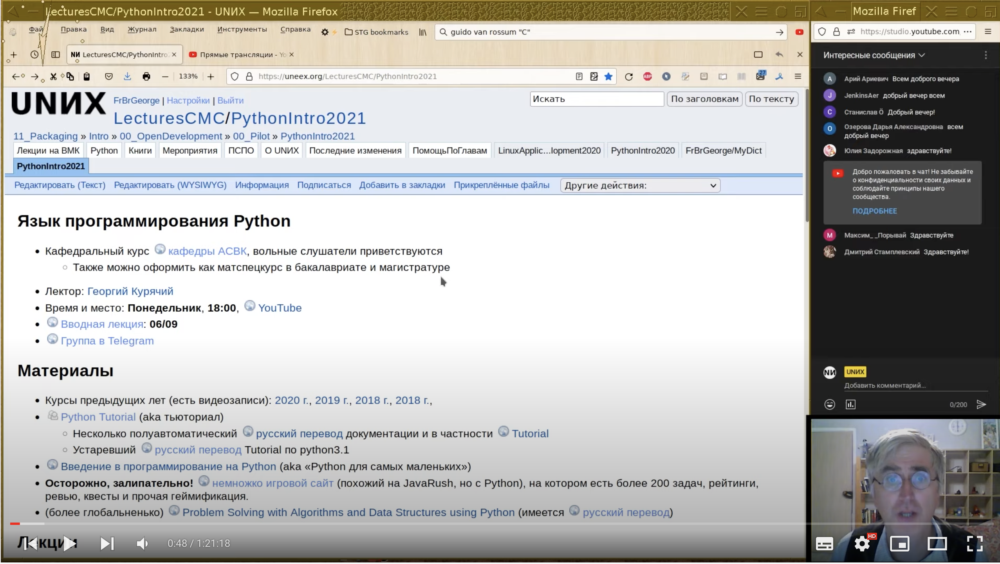

# 🐍 Python. Cпецкурс Г.В. Курячего. Осень 2021 года.
* 📄 [Страница курса](https://uneex.org/LecturesCMC/PythonIntro2021)
* 🎥 [Записи лекций на ютубе](https://www.youtube.com/watch?v=vSct_zYIHZA&list=PL6kSdcHYB3x4a_XEgZSeUnzMroujtDw0H)
* 👨‍🏫 Лектор: [Георгий Курячий](https://uneex.org/FrBrGeorge)

### Темы лекций:
0. История Python и планы на семестр
1. Командная строка и объекты
2. Логические выражения, условные операторы и цикл
3. Последовательности и цикл for
4. Функции и замыкание
5. Числа и строки
6. Множества и словари
7. Итераторы
8. Объектная модель Python
9. Наследование и исключения
10. Слоты, дескрипторы, декораторы
11. Работа с файлами
12. Метаклассы и аннотации
13. Асинхронные возможности
14. Модули и шаблоны. Куда двигаться дальше

